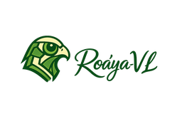
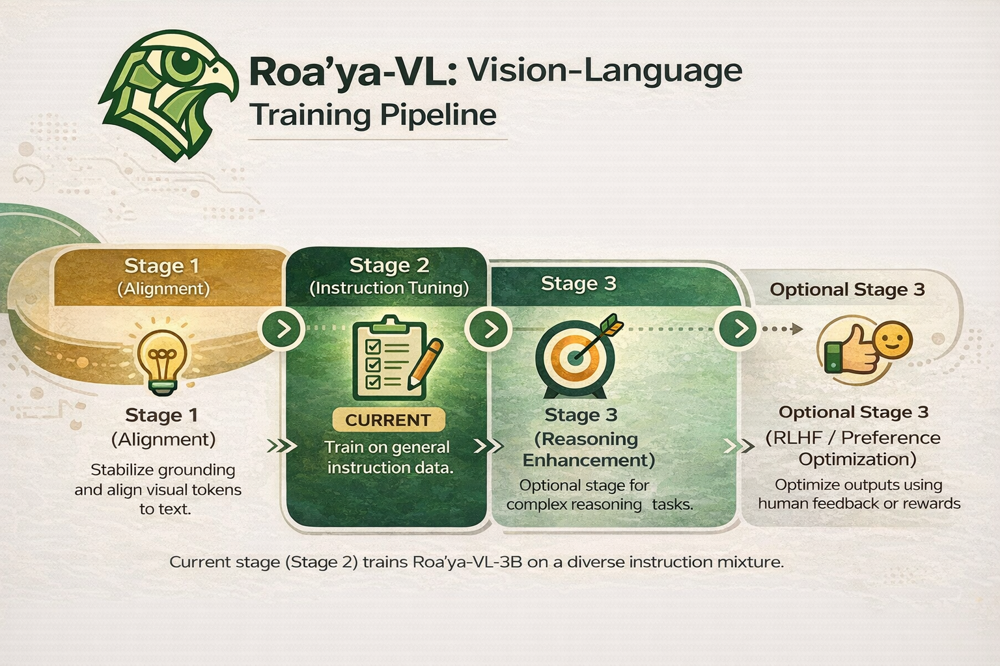
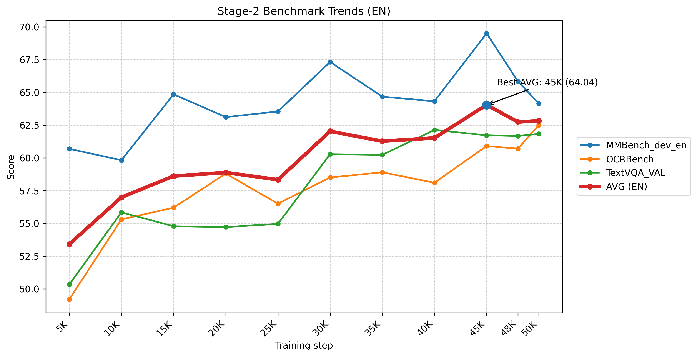

  

  مشروع رؤيا (PoC) — إطار عملي لبناء وتقييم نماذج لغوية-بصرية عربي–إنجليزي لفهم الصور وقراءة النصوص داخلها (OCR) والاستدلال.
  يهدف المشروع إلى توثيق أفضل الممارسات عبر مراحل تطوير نماذج VLM: المواءمة/ما قبل التدريب (عند الحاجة)، الضبط الخاضع للإشراف (SFT)،
  ثم التحسين اللاحق باستخدام أساليب التفضيل مثل DPO و GRPO عند توفر بيانات مناسبة.

<h1 align="center" style="font-size:40px; line-height:1.15; margin:10px 0 8px;">
  Roa’ya-VL: A Practical Framework for Arabic–English Vision-Language Models
</h1>

  Not a single model — a modular recipe for building Arabic–English VLMs (OCR + Doc + VQA + Reasoning).
   
  Current reference build: DeepSeek-OCR–style vision encoder + projector + Qwen2.5-VL-3B backbone.

  <b>Yakoub Bazi</b>1 ·
  <b>Mansour Zuair</b>1 ·
  <b>Mohamad Mahmoud Al Rahhal</b>2

  1Computer Engineering Department, College of Computer and Information Sciences, King Saud University, Riyadh 11543, Saudi Arabia 
  
    {ybazi, zuair}@ksu.edu.sa
  
    
  2Applied Computer Science Department, College of Applied Computer Science, King Saud University, Riyadh 11543, Saudi Arabia 
  
    malrahhal@ksu.edu.sa
  

  
  
  
  

<h2>🔥 Status</h2>
<ul>
  <li><b>Stage-2 (SFT instruction tuning)</b> completed up to <b>~50K steps</b></li>
  <li>Data mixture size: <b>~18.0M samples</b> (loaded: <b>17,937,575</b>)</li>
  <li>Selected best checkpoint: <b>~45K</b> (used as Stage-2 reference)</li>
  <li><b>Stage-2.5 Arabic consolidation</b> is under active iteration (Arabic OCR/Doc + Arabic instruction + optional culture-focused content)</li>
</ul>

<blockquote>
  <b>Key idea:</b> Roa’ya-VL is a <b>framework</b> (recipes + evaluation + best practices), not a claim about one fixed architecture.
  The current reference build is one instantiation used to validate the pipeline end-to-end.
</blockquote>

<h2>🎯 What Roa’ya-VL is</h2>

<b>Roa’ya-VL</b> is a practical, modular framework for building Arabic–English VLMs that can:

<ul>
  <li>read and reason over text inside images (<b>OCR / Doc / Screen / Signs</b>),</li>
  <li>answer questions grounded in images (<b>VQA + reasoning</b>),</li>
  <li>improve Arabic visual understanding via targeted consolidation.</li>
</ul>

<h2>🧩 Framework Components (swappable)</h2>
<ul>
  <li><b>Vision encoder:</b> OCR-centric or general-purpose vision towers</li>
  <li><b>Projector:</b> lightweight adapters (e.g., MLP variants)</li>
  <li><b>LLM backbone:</b> instruction-tuned backbones (3B class and beyond)</li>
  <li><b>Stage-wise recipes:</b> Alignment/Pretraining (optional) → SFT → Preference optimization</li>
  <li><b>Evaluation:</b> standardized benchmarking (e.g., VLMEvalKit integration)</li>
</ul>

<h3>Current reference build (prototype)</h3>
<ul>
  <li><b>Vision:</b> DeepSeek-OCR–style (token-efficient, OCR-oriented)</li>
  <li><b>Backbone:</b> Qwen2.5-VL-3B</li>
  <li><b>Projector:</b> mlp2x_gelu</li>
</ul>

<blockquote>
  <b>Note:</b> We explicitly treat this as a <b>reference configuration</b>.
  The framework is designed to support alternative vision encoders/backbones and compare their behavior across stages.
</blockquote>

<h2>🧱 Training Pipeline (stage-wise)</h2>

  

<i>
Base build → Stage-2 SFT (broad instruction mix) → Stage-2.5 Arabic consolidation → Preference optimization (DPO/GRPO) when data is available.
</i>

<h2>📈 Stage-2 Validation (reported)</h2>

  

<i>
Stage-2 checkpoint trajectory on representative benchmarks; best checkpoint (~45K) is used as the Stage-2 reference.
</i>

<h2>🏗️ Stages</h2>

<h3>Stage-2 — Supervised Instruction Tuning (SFT)</h3>
<ul>
  <li><b>Goal:</b> build a stable bilingual base (OCR + reasoning + instruction following)</li>
  <li><b>Practice:</b> broad multi-domain mix + checkpoint selection using a validation trajectory</li>
</ul>

<h3>Stage-2.5 — Arabic Consolidation (targeted SFT)</h3>
<ul>
  <li><b>Goal:</b> boost Arabic OCR/Doc + Arabic instruction without collapsing general ability</li>
  <li><b>Practice:</b> careful sampling, frequent evaluation, and monitoring for forgetting</li>
</ul>

<h3>Preference Optimization (when data exists)</h3>
<ul>
  <li><b>Goal:</b> improve helpfulness/formatting and reduce hallucinations</li>
  <li><b>Methods:</b> <b>DPO</b> and <b>GRPO</b> (Arabic preference data is especially valuable)</li>
</ul>

<h2>🧪 Evaluation</h2>

We run standardized evaluations via <b>VLMEvalKit</b> to track progress across checkpoints/stages.
For Stage-2.5, we typically evaluate every <b>500–1000 steps</b> because improvements can appear gradually and differ by skill (OCR vs reasoning vs instruction following).

<h2>📦 Resources</h2>
<ul>
  <li><b>Project page:</b> https://yakoubbazi.github.io/Roaya-VL/</li>
  <li><b>Code:</b> https://github.com/yakoubbazi/Roaya-VL</li>
</ul>

<h2>🙏 Acknowledgement</h2>
<ul>
  <li><b>LLaVA-NeXT</b> https://github.com/LLaVA-VL/LLaVA-NeXT</li>
  <li><b>DeepSeek-OCR</b> https://github.com/deepseek-ai/DeepSeek-OCR</li>
  <li><b>VLMEvalKit</b> https://github.com/open-compass/VLMEvalKit</li>
</ul>

<blockquote>
  Note: Roa’ya-VL is an independent project and is not affiliated with the above repositories.
</blockquote>

<h2>📌 Citation (project)</h2>
<pre><code class="language-bibtex">
@misc{roaya_vl_poc_2026,
  title   = {Roa'ya-VL: A Practical Framework for Arabic--English Vision-Language Models (Proof of Concept)},
  author  = {Bazi, Yakoub and Zuair, Mansour and Al Rahhal, Mohamad Mahmoud},
  year    = {2026},
  note    = {Project repository and technical notes}
}
</code></pre>
