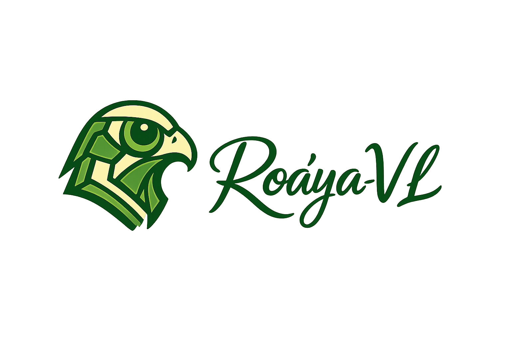

  

  <b>رؤيا</b>

<h1 align="center">
  Roa’ya-VL-3B: Compression-First Visual Tokenization for Arabic–English VLMs
</h1>

  <b>Yakoub Bazi</b>1 · <b>Mansour Zuair</b>1 · <b>Mohamad Mahmoud Al Rahhal</b>2 
  1King Saud University · 2King Saud University

  
  
  
  

---

### 🔥 Status
Wo
