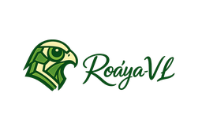
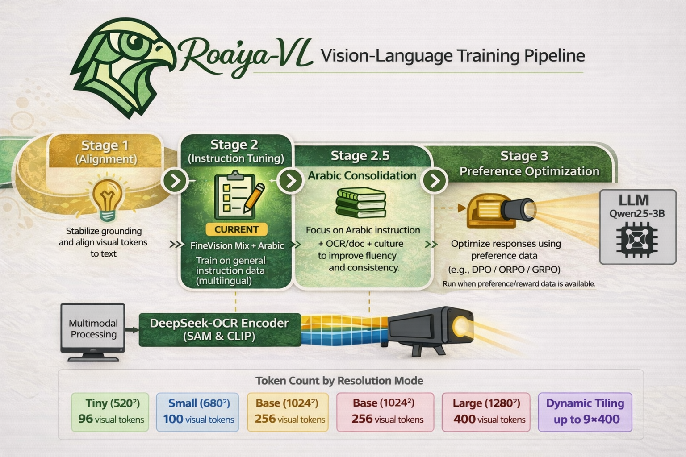
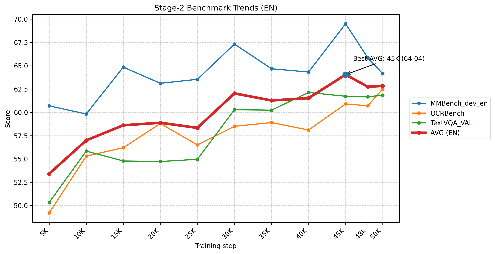

<p align="center">
  
</p>

<p align="center" style="color:#4b5563; margin-top:-10px; font-size:20px; font-weight:800;">
 مشروع رؤيا — نموذج لغوي-بصري عربي–إنجليزي لفهم الصور وقراءة النصوص (OCR). 
  يهدف المشروع إلى توثيق أفضل الممارسات عبر مراحل بناء نماذج VLM: ما قبل التدريب , الضبط الخاضع للإشراف (SFT)،
  ثم التعلم التعزيزي (DPO/GRPO) </p>

<h1 align="center" style="font-size:42px; line-height:1.15; margin:10px 0 8px;">
   Roa'ya-VL-3B (رؤيا): Best Practices for Building Bilingual Arabic-English Vision-Language Models 
</h1>

<p align="center">
  <b>Yakoub Bazi</b><sup>1</sup> ·
  <b>Mansour Zuair</b><sup>1</sup> ·
  <b>Mohamad Mahmoud Al Rahhal</b><sup>2</sup>
</p>

<p align="center" style="color:#4b5563; font-size:14px; line-height:1.5; margin-top:-6px;">
  <sup>1</sup>Computer Engineering Department, College of Computer and Information Sciences, King Saud University, Riyadh 11543, Saudi Arabia<br/>
  <span style="font-family:ui-monospace, SFMono-Regular, Menlo, Monaco, Consolas, 'Liberation Mono', 'Courier New', monospace;">
    {ybazi, zuair}@ksu.edu.sa
  </span>
  <br/><br/>
  <sup>2</sup>Applied Computer Science Department, College of Applied Computer Science, King Saud University, Riyadh 11543, Saudi Arabia<br/>
  <span style="font-family:ui-monospace, SFMono-Regular, Menlo, Monaco, Consolas, 'Liberation Mono', 'Courier New', monospace;">
    malrahhal@ksu.edu.sa
  </span>
</p>

<p align="center">
  <a href="#" target="_blank">
    
  </a>
  <a href="https://yakoubbazi.github.io/Roaya-VL/" target="_blank">
    
  </a>
  <a href="https://github.com/yakoubbazi/Roaya-VL" target="_blank">
    
  </a>
  <a href="#" target="_blank">
    
  </a>
</p>

---

## 🔥 Status
**Stage-2 (instruction tuning) completed up to ~50K steps.**  
- Data mixture size: **~18.0M samples** (loaded: **17,937,575**)  
- Batch size: **128**  
- Selected **best checkpoint: 45K** (used as the Stage-2 model for reporting and next stages)

---

## 📢 Latest Updates
- **2026-02-17**: Added Stage-2 validation trajectory figure (**MMBench-EN / OCRBench / TextVQA / Avg**).
- **2026-02-17**: Selected **best Stage-2 checkpoint (45K)** from the trajectory (trained up to **50K**).

---

## 🧱 Training pipeline (current: Stage 2)
<p align="center">
  
</p>
<p align="center"><i>Stage-2 instruction tuning: DeepSeek-OCR–inspired compression-first visual tokenization + projector + Qwen2.5-VL-3B backbone, trained on a FineVision mix with Arabic.</i></p>

---

## 📈 Stage-2 validation trajectory (reported)

<p align="center">
  
</p>
<p align="center"><i>Validation trend across Stage-2 checkpoints (MMBench-EN, OCRBench, TextVQA, and Average). We report the best checkpoint (~45K) as the final Stage-2 model.</i></p>

---

## What is Roa’ya-VL?
We introduce Roa’ya-VL-3B, a bilingual Arabic–English vision–language model (VLM) aimed at practical Arabic–English visual understanding, with emphasis on reading and reasoning over text in images (OCR), document-style inputs, and general vision–language tasks such as VQA and grounded reasoning.

Roa’ya-VL-3B follows a modular design (vision encoder + projector + LLM backbone). In the current reference version, we use:
• Vision encoder: DeepSeek-OCR (OCR-centric, compression-first tokenization; SAM & CLIP features) as a strong baseline choice, with the design kept open to switching the vision tower in future versions
• A lightweight projector
• Backbone LLM: Qwen2.5-VL-3B

The model supports token-efficient regimes (e.g., 256/400 visual tokens) and document-scale tiling (up to 9×400 tokens) for long or dense pages. We structure development in stages (alignment → instruction tuning → Arabic consolidation → preference optimization) and track intermediate validation to understand how data mixture and Arabic-focused consolidation affect OCR fidelity, document understanding, reasoning, and bilingual instruction-following.

---

## Resources
- **Project page:** https://yakoubbazi.github.io/Roaya-VL/
- **Code:** https://github.com/yakoubbazi/Roaya-VL
- **Paper:** soon
- **Models:** soon

---

## Roadmap
- [x] Stage-2 instruction tuning to **~50K steps**
- [x] Pick **best checkpoint (~45K)** based on Stage-2 validation trend
- [ ] Expanded evaluation on additional benchmarks (InfoVQA, POPE, MMMU, MMStar, etc.)
- [ ] **Stage-2.5 Arabic consolidation** (Arabic instruction + OCR/doc + culture)
- [ ] Stage-3 **preference optimization** (DPO / ORPO / GRPO) when preference/reward data is ready
- [ ] Teaser examples (OCR / Doc / VQA / multi-image)
- [ ] Reproducibility checklist (scripts + configs)
- [ ] Public release (weights + code + evaluation)

---
## 🚀 Quickstart (Clone + Install + Run a Demo)

1) Clone the repository
```bash
git clone https://github.com/yakoubbazi/Roaya-VL.git
cd Roaya-VL
conda create -n roaya python=3.10 -y
conda activate roaya
pip install -r requirements.txt

2) Download the model from Hugging Face
```bash
pip install -U huggingface_hub
huggingface-cli login
huggingface-cli download BigData-KSU/Roaya-VL-3B --local-dir ./checkpoints/Roaya-VL-3B

3) Run Demo
```bash
python Infer.py \
  --model_path ./checkpoints/Roaya-VL-3B \
  --image examples/Train_Pipeline.png \
  --prompt "Describe the training pipeline or RoayaVL."

---

## Acknowledgement
- **LLaVA-NeXT**: the codebase we built upon for training/evaluation utilities and core VLM engineering components.  
  https://github.com/LLaVA-VL/LLaVA-NeXT

- **DeepSeek-OCR**: the OCR-style, compression-first vision encoder inspiration we adopt/adapt for token-efficient visual tokenization in Roa’ya-VL.  
  https://github.com/deepseek-ai/DeepSeek-OCR

- **VLMEvalKit**: the evaluation toolkit we used to integrate Roa’ya-VL and run standardized evaluations across multiple VLM benchmarks.  
  https://github.com/open-compass/VLMEvalKit

> **Note:** Roa’ya-VL is an independent research project and is not affiliated with LLaVA-NeXT, DeepSeek-OCR, or VLMEvalKit.

---

## Citation
```bibtex
@article{bazi2025roaya,
  title   = {Roa'ya-VL:  Roa’ya-VL: Arabic–English VLM Model },
  author  = {Bazi, Yakoub and Zuair, Mansour and Al Rahhal, Mohamad Mahmoud},
  journal = {arXiv preprint arXiv:XXXX.XXXXX},
  year    = {2026}
}
